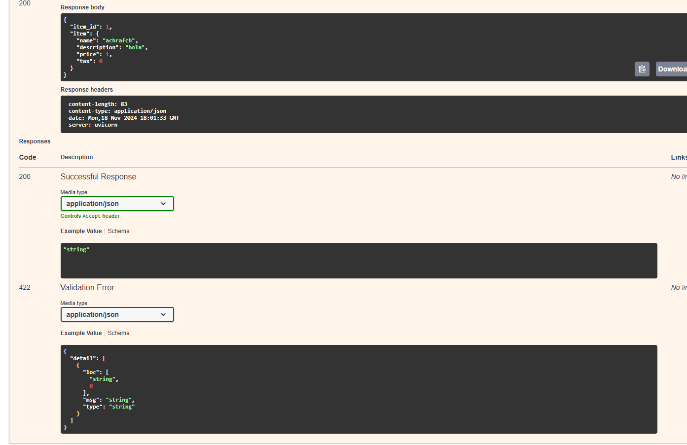
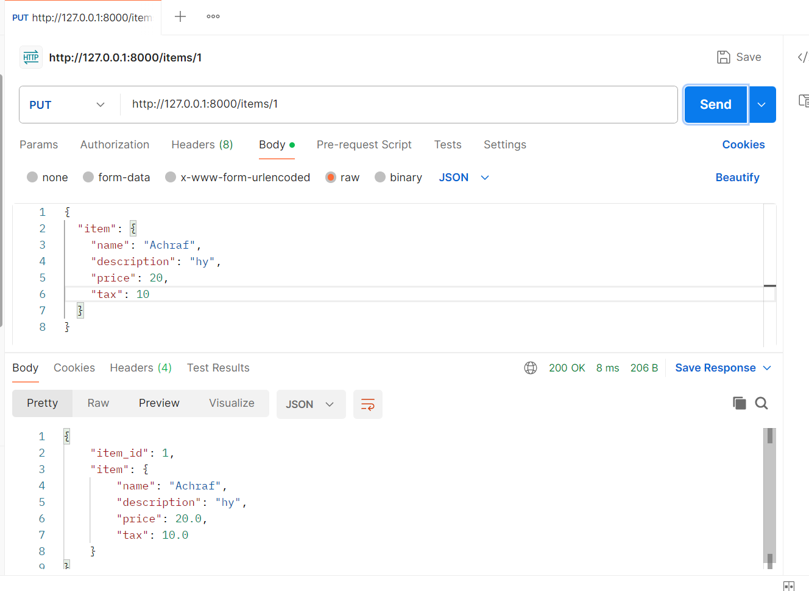
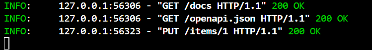

# Activitat_ 9 main2 documentació

## Primera prova: Swagger

Aqui he fet una prova utilitzant swagger, tipus de endpoint PUT, insertant un format json.

## Segona prova: Postman

El mateix resultat que el cas anterior pero utilitzan postman, resultat aprovat, insertant un format json tambe.

## Resposta servidor

Aqui on es veu la resposta del servidor despres de la petició desde postman. 200 ok.

