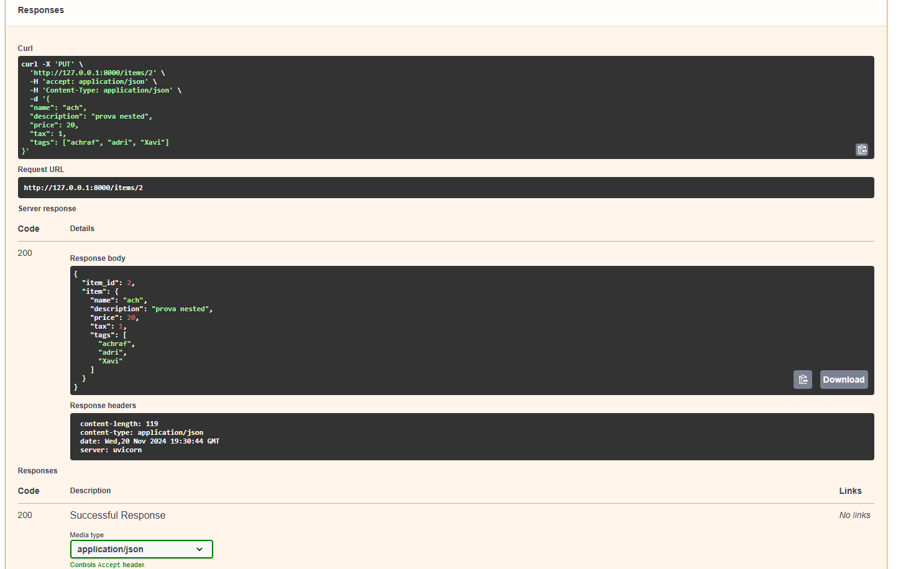
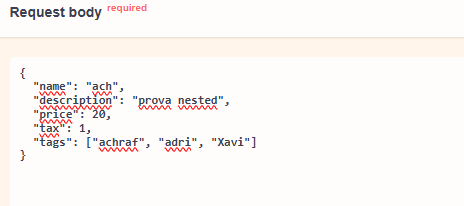
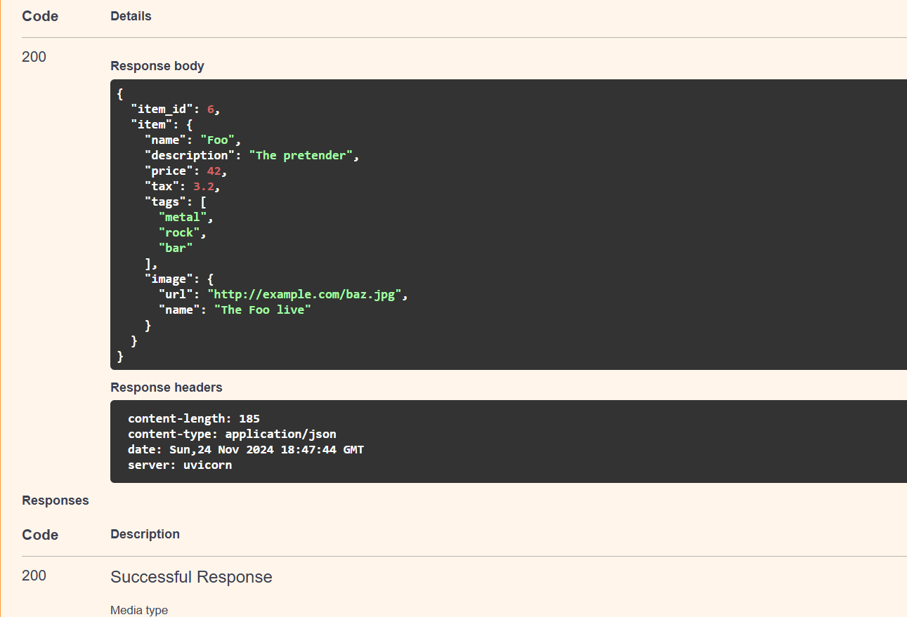
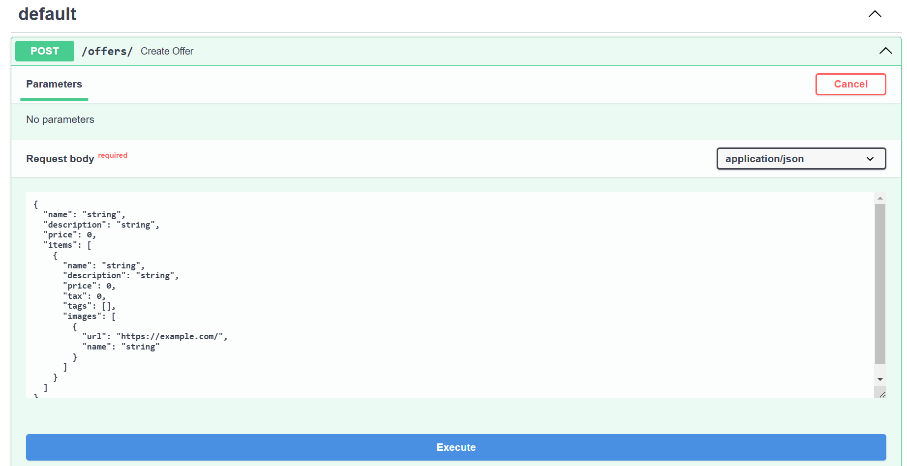

# Documentació Body-Neseted mdoels

## Explicació del primers exemples:
En els primers exemples, ens explica gestionar el tema de estructures de dades utilitzant listes i altres subtipus com per exemple models listes simples o especificades amb tipus de dades.

## Prova feta amb Swagger:



En aquesta captura podem veure la resposta del swagger fent servir el endpoint que tenim al codi, on podem insertar al ultim camp una lista no especificada, que vol dir que podem insertar diferents tipus e dades, i resposta aprovada en aquest cas.

## Format de las dades insertades:


Aqui podem veure el format de les dades que insertem, el cual és un json. I també podem veure el camp on insertem la lista "tags".


## Llistes amb tipus especificats

En aquest cas, definim que la llista només pot contenir cadenes (`str`).

## Exemple:
class Item(BaseModel):
    tags: list[str] = []


## Captures de proves fetes:


En aquesta captura es veu como hem pogut insertar una lista en el text, dins la etiqueta tags on accepta tipus string, resposta 200 ok.


Aqui hem espicificat un tipus de list (int), i hem intentat insertar tipus string, dona error.


La resposta en la consola en veu aixi, unprocessable entity.

## Exemple amb conjunts (`set`)

Per assegurar que els valors siguin únics (com les etiquetes), podem utilitzar el tipus `set`.

### Exemple:
```python
class Item(BaseModel):
    tags: set[str] = set()
```
## Models anidats

Els models de Pydantic poden tenir atributs que són altres models de Pydantic. Això ens permet treballar amb estructures JSON complexes.

## exemple:
class Image(BaseModel):
    url: str
    name: str

class Item(BaseModel):
    name: str
    image: Image

## Prova:

Aqui podem veure com hem pogut insertar dades utilitzant submodels.


## Models profundament anidats

Els models Pydantic permeten crear estructures profundament anidades, com ara ofertes que contenen ítems amb imatges.

## Exemple:
class Image(BaseModel):
    url: HttpUrl
    name: str

class Item(BaseModel):
    name: str
    images: list[Image] | None = None

class Offer(BaseModel):
    name: str
    items: list[Item]




En aquesta captura es veu el format de json que insertem, en aquest cas estem creant una offer relacionant el item amb imatge, ja que imatge te el seu format, i insertem aquest format dins un item.

## Dicts arbitraris

Per declarar un cos que sigui un `dict` amb claus i valors arbitraris; Es poden declarar dicts amb tipus de clau i valor específics

## exemple:
async def create_index_weights(weights: dict[int, float]):
    return weights

el format d'aquest cas seria aixis:
{
    "1": 0.5,
    "2": 1.0
}
on el 1 representa el int, i 0.5 el float.