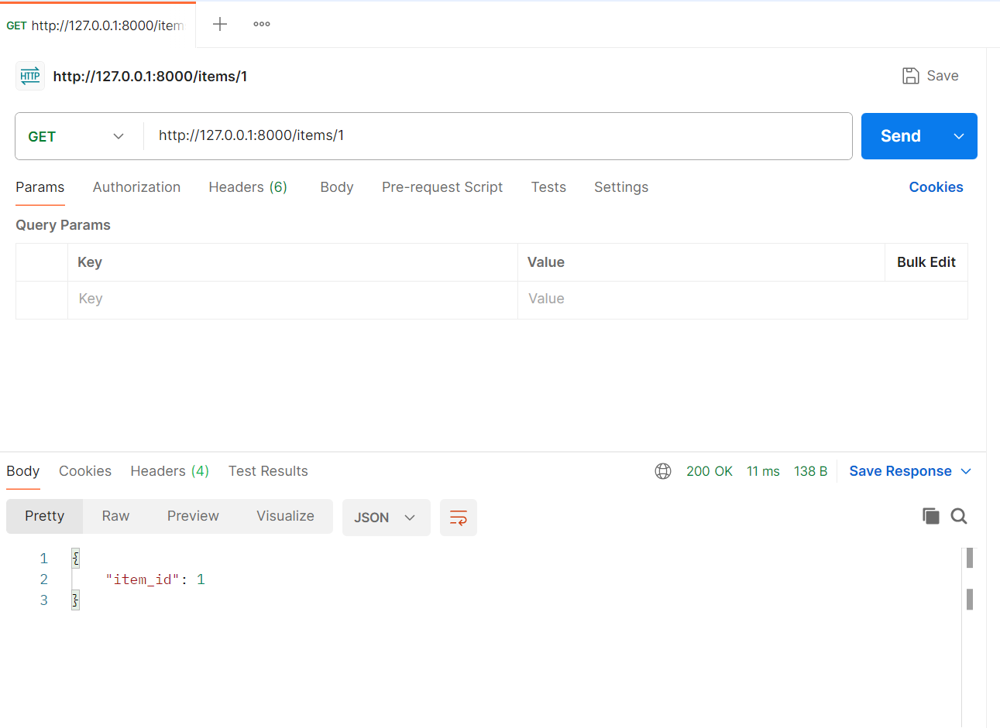
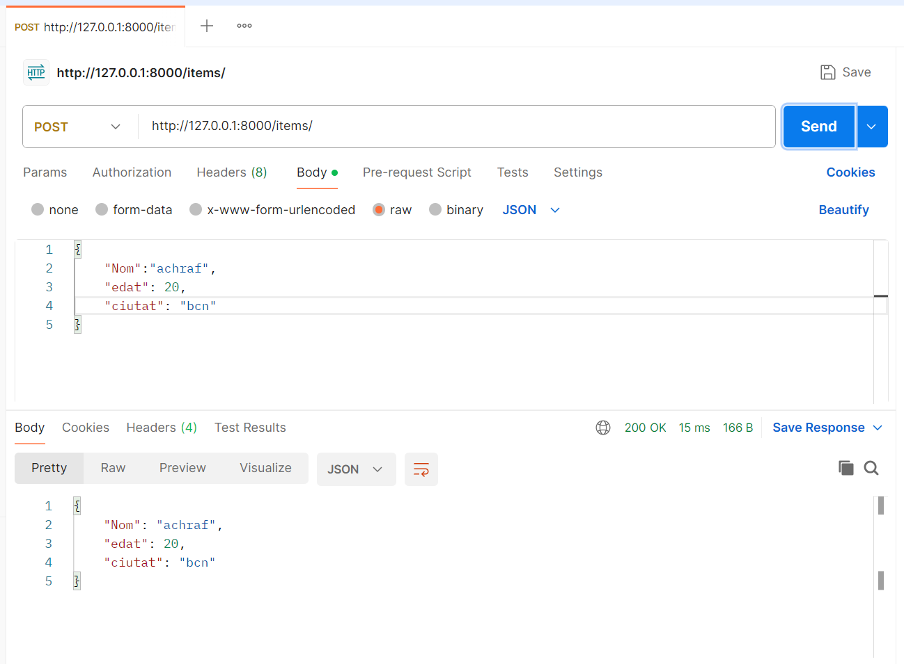

# UF2_FASTAPI

## Prova Get Swagger

Captura on es mostra el resultat del endpoint get, utilitzant un id per filtrar.

## Prova post Swagger

Captura on s'ha fet prova de insertar dades de diferents tipus, y el resultat positiu.

## Prova get postman

En la captura es mostra que el endpoint get fonciona correctament en postman també

## Prova post Postman

